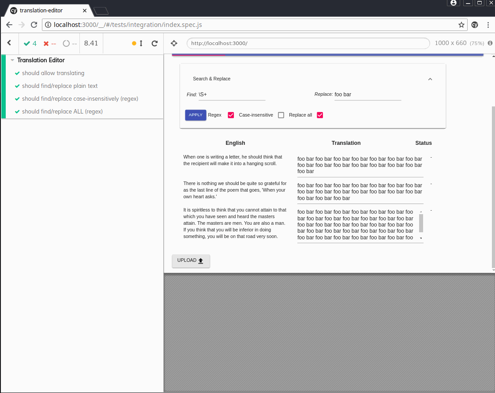

### Current functionality
- Edit the translation for each source segment
- Apply search/replace operations on target segments

The aim of this project is to make a fully functional translation editor prototype.

### Tools used
- React
- Redux
- Material UI
- GraphQL
- Cypress (e2e)

 (Image: E2e testing is actually fun with Cypress. Try it yourself!)

### Planned features
- Segment filtering options, including full text search
- Search & replace
- Language checks
